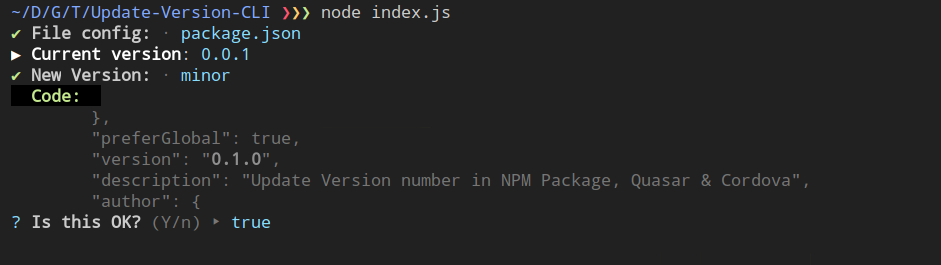

# Update Version CLI

[](https://travis-ci.org/TiagoDanin/Update-Version-CLI) [](https://npmjs.org/package/update-version-cli) [](https://npmjs.org/package/update-version-cli) [](https://npmjs.org/package/update-version-cli) [](https://github.com/xojs/xo) 

Update Version number in NPM Package, Quasar & Cordova

<p align="center"></p>

## Installation

Module available through the [npm registry](https://www.npmjs.com/). It can be installed using the  [`npm`](https://docs.npmjs.com/getting-started/installing-npm-packages-locally) or [`yarn`](https://yarnpkg.com/en/) command line tools.

```sh
# NPM
npm install update-version-cli --global
# Or Using Yarn
yarn global add update-version-cli
```

## Usage

```sh
update-version-cli
```

## Tests

To run the test suite, first install the dependencies, then run `test`:

```sh
# NPM
npm test
# Or Using Yarn
yarn test
```

## Dependencies

<details>
	<summary><a href="https://ghub.io/chalk">chalk</a>: Terminal string styling done right</summary>
	<b>Author</b>: qix, sindresorhus</br>
	<b>License</b>: MIT</br>
	<b>Version</b>: ^3.0.0
</details>
<details>
	<summary><a href="https://ghub.io/enquirer">enquirer</a>: Stylish, intuitive and user-friendly prompt system. Fast and lightweight enough for small projects, powerful and extensible enough for the most advanced use cases.</summary>
	<b>Author</b>: Jon Schlinkert</br>
	<b>License</b>: MIT</br>
	<b>Version</b>: ^2.3.2
</details>
<details>
	<summary><a href="https://ghub.io/semver">semver</a>: The semantic version parser used by npm.</summary>
	<b>Author</b>: adam_baldwin, ahmadnassri, annekimsey, billatnpm, claudiahdz, darcyclarke, isaacs, mikemimik, ruyadorno</br>
	<b>License</b>: ISC</br>
	<b>Version</b>: ^7.1.1
</details>

## Dev Dependencies

<details>
	<summary><a href="https://ghub.io/xo">xo</a>: JavaScript linter with great defaults</summary>
	<b>Author</b>: Sindre Sorhus</br>
	<b>License</b>: MIT</br>
	<b>Version</b>: ^0.25.3
</details>

## Contributors

Pull requests and stars are always welcome. For bugs and feature requests, please [create an issue](https://github.com/TiagoDanin/Update-Version-CLI/issues). [List of all contributors](https://github.com/TiagoDanin/Update-Version-CLI/graphs/contributors).

## License

[MIT](LICENSE) © [Tiago Danin](https://TiagoDanin.github.io)